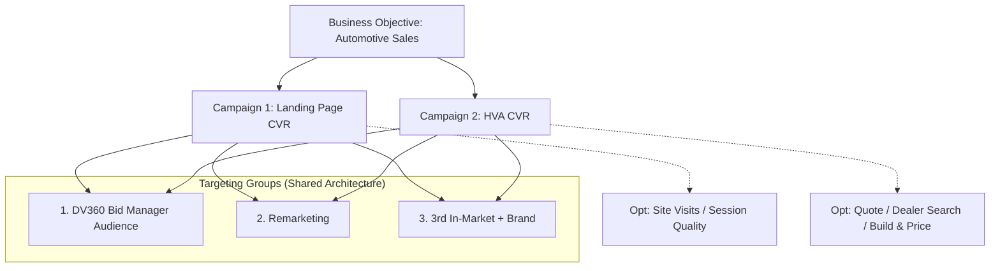

# Automotive — Campaign Evolution (2019→2025) | Paid Media Playbook

**Confidentiality:** No client name, no platform screenshots, no account IDs. This document focuses on **operating approach and campaign structure**. Detailed performance comparisons are documented separately.

> **🧭 How this differs from other projects**
>
> - This page is a **paid-media playbook** focused on campaign architecture and optimization logic.
> - It demonstrates the practical application of data measurement (GA4/GTM) discussed in my [Execution Framework](https://soohoon-dev.github.io/book-execution-framework/) project.

---

## Executive Summary

This playbook documents a multi-year evolution of DV360 programmatic display campaigns for automotive accounts, shifting from mass-reach to **conversion-first optimization**.

**Key Outcomes (Based on 2025 Performance):**

- **High Engagement:** Achieved a Total CTR of **3.86%** (peaking at 17.63% for In-Market audiences).
- **Cost Efficiency:** Optimized Avg. CPC to **$0.05** through precise audience filtering and exclusions.
- **Scale:** Delivered over **158,000 high-quality clicks** while maintaining strict budget controls.

---

## 1) Scope

- **Channel focus:** DV360 Programmatic Display (primary)
- **Market context:** KR/CN audience operations (anonymous)
- **Time period covered:** 2019–2025 (Operational transition period)

---

## 2) Measurement setup (GA4 + GTM)

Reliable data collection is the foundation of this strategy.

1.  Set up and QA conversion events in **GTM** (Google Tag Manager).
2.  Validate event collection and conversion definitions in **GA4**.
3.  **Feedback Loop:** Use these conversion events as the specific learning signal for DV360 automated bidding.

---

## 3) DV360 Campaign Structure

### 3.1 Strategic Overview

To optimize budget efficiently, the account was restructured to separate "Browsing" intent from "Buying" intent.

### 3.2 Two campaigns for the same business objective

To keep learning signals clean, the budget is split into two distinct optimization goals:

1.  **Landing Page CVR campaign**
    - Optimizes for landing page visitor behavior (Cost-effective traffic driver).
2.  **HVA (High-Value Audience) CVR campaign**
    - Optimizes toward high-intent actions.
    - _HVA Examples:_ Quote request button click, "Build & Price" interaction, Visits to Payment/Dealer pages.

### 3.3 Shared ad group architecture

Each campaign uses the same 3 targeting groups to enable "Apples-to-Apples" performance comparison:

1.  **DV360 Bid Manager Audience:** Google's suggested affinity/in-market lists.
2.  **Remarketing:** Previous site visitors.
3.  **3rd In-Market + Brand + Conquest:** 1st-party brand audience + 3rd-party competitor data.

---

## 4) Operating Rules (Optimization)

- **Daily Hygiene:** Monitor delivery stability and budget pacing.
- **Core Metrics:** CTR and CPC (proxy for traffic quality), followed by CPA.
- **Quality Control (Exclusions):**
  - Maintained strict exclusion lists for URLs, domains, and Apps to suppress invalid or low-quality clicks.
  - _Example:_ Identifying app placements with high clicks but zero dwell time and adding them to the exclusion list reduced wasted spend.
- **Cost Control:** Utilized Frequency Caps and Max CPC limits to prevent overbidding on retargeting pools.

---

## 5) Targeting Group Performance Snapshot

_Note: Campaign naming is anonymized to model-level labels. Data reflects stabilized performance period._

| Model        | Goal            | Targeting group                 | Impr.         | Clicks      | CTR       | Avg. CPC  | Avg. CPM  | Cost          |
| ------------ | --------------- | ------------------------------- | ------------- | ----------- | --------- | --------- | --------- | ------------- |
| EV model     | Landing Page CV | DV360 Bid Manager Audience      | 721,656       | 30,015      | 4.16%     | $0.05     | $2.13     | $1,534.73     |
| EV model     | Landing Page CV | Remarketing                     | 18,744        | 216         | 1.15%     | $0.05     | $0.61     | $11.44        |
| EV model     | Landing Page CV | 3rd InMarket + Brand + Conquest | 3,991         | 661         | 16.56%    | $0.04     | $6.27     | $25.02        |
| EV model     | HVA CV          | DV360 Bid Manager Audience      | 538,936       | 18,803      | 3.49%     | $0.06     | $1.96     | $1,055.95     |
| EV model     | HVA CV          | Remarketing                     | 37,654        | 436         | 1.16%     | $0.05     | $0.61     | $23.11        |
| EV model     | HVA CV          | 3rd InMarket + Brand + Conquest | 4,362         | 769         | 17.63%    | $0.04     | $7.28     | $31.75        |
| Hybrid model | Landing Page CV | Remarketing                     | 1,754,916     | 53,024      | 3.02%     | $0.05     | $1.50     | $2,635.50     |
| Hybrid model | Landing Page CV | DV360 Bid Manager Audience      | 96,632        | 7,462       | 7.72%     | $0.05     | $3.64     | $352.16       |
| Hybrid model | Landing Page CV | 3rd InMarket + Brand + Conquest | 4,432         | 531         | 11.98%    | $0.07     | $7.79     | $34.52        |
| Hybrid model | HVA CV          | DV360 Bid Manager Audience      | 845,405       | 43,713      | 5.17%     | $0.05     | $2.78     | $2,346.06     |
| Hybrid model | HVA CV          | Remarketing                     | 60,807        | 804         | 1.32%     | $0.04     | $0.59     | $35.78        |
| Hybrid model | HVA CV          | 3rd InMarket + Brand + Conquest | 10,126        | 1,600       | 15.80%    | $0.06     | $9.40     | $95.21        |
| **TOTAL**    |                 |                                 | **4,097,661** | **158,034** | **3.86%** | **$0.05** | **$2.00** | **$8,181.24** |

---

## 6) Performance Highlights & Insights

Based on the data above, three key patterns emerged:

1.  **Highest Intent (CTR 11%~17%):**
    - The `3rd In-Market + Brand + Conquest` group showed exceptionally high CTRs (up to 17.63%).
    - _Insight:_ Although the CPM ($6~$9) is higher, the precision targeting of active car shoppers justifies the cost, delivering high-quality traffic.
2.  **Best Efficiency (CPC $0.05):**
    - Despite the high competition in the auto vertical, strict bid caps and optimization kept the average CPC at $0.05 across 4M impressions.
3.  **Volume Driver:**
    - `DV360 Bid Manager Audience` provided the necessary scale (reach) while maintaining a healthy CTR (~3-5%), acting as the backbone of the campaign.

---

## 7) Why this structure is effective

- **Learning Quality:** Separates **upper-intent site traffic** from **high-intent actions** (HVA), allowing the algorithm to bid differently for a "browser" vs. a "shopper."
- **Comparability:** Keeps targeting groups consistent so performance can be compared apples-to-apples across different car models.
- **Scalability:** Makes optimization and budget controls (frequency cap / max CPC / exclusions) easier to manage at scale across multiple accounts.

---

## 8) Portfolio Linkage

This playbook complements my personal project below, demonstrating the real-world application of the measurement frameworks I build.

- **Related Project:** [Book-based Execution Framework Analysis](https://soohoon-dev.github.io/book-execution-framework/)
- **Connection:** This project utilizes the GA4/GTM data pipelines that were conceptualized and tested in the framework analysis.
