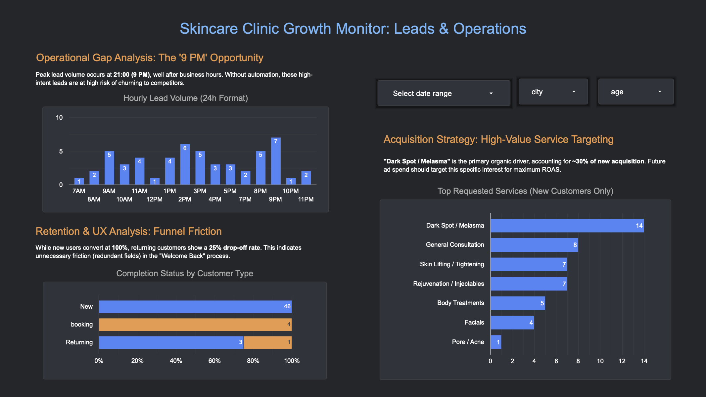

# Zero-Budget Growth Strategy: Skincare Clinic Optimization 🏥

## 📌 Project Overview

**"How can we increase bookings without spending a single dollar on ads?"**

This project answers that question for a Skincare Clinic in Los Angeles. The client had a functional website but suffered from unutilized data and lead leakage. Instead of suggesting an immediate budget increase, I engineered a data pipeline to identify operational inefficiencies and proposed a **"Zero-Budget Growth Strategy"**.

## 📊 Key Deliverables (Dashboard)

I built an interactive dashboard to visualize the "hidden leaks" in the funnel.

_(Click to view full dashboard)_

## 🔍 Key Insights & Technical Discovery

### 1. The "9 PM Golden Time" Leak (Operational Gap)

- **Discovery:** Using Python to parse timestamp logs, I found that **13% of leads** arrive at **21:00 (9 PM)**, well after business hours.
- **Impact:** High churn risk due to delayed response (12+ hours).
- **Solution:** Proposed a **Night-Shift CRM Automation** script to capture these leads instantly.

### 2. Funnel Friction Analysis (UX)

- **Discovery:** While New Customers convert at **100%**, Returning Customers show a **25% drop-off rate**.
- **Impact:** Loyal customers are frustrated by redundant form fields.
- **Solution:** Designed a "One-Click Booking" logic to remove friction for VIPs.

### 3. High-Value Targeting (Data-Driven Ad Strategy)

- **Discovery:** SQL analysis revealed that **30% of new inquiries** are specifically for **"Dark Spot / Melasma"** treatments.
- **Action:** This data validates that future ad spend should target "Pigmentation Concerns" rather than generic branding.

## 🛠️ Technical Workflow

### 1. Data Engineering (Python)

- **Challenge:** Raw data was stored in a nested JSON format within a CSV column.
- **Action:** Built an ETL pipeline using `pandas` to parse JSON strings and map Service IDs to readable names.
- **Code:** [View Python Script](./scripts/01_data_preprocessing.py)

### 2. Scalability (SQL / BigQuery)

- **Challenge:** Preparing for future data scale (1M+ rows).
- **Action:** Wrote Standard SQL queries to perform the same transformation and analysis in a Data Warehouse environment.
- **Code:** [View SQL Queries](./queries/bigquery_analysis.sql)

### 3. Visualization (Looker Studio)

- **Action:** Connected processed data to Looker Studio for real-time monitoring.
- **Design:** Implemented a "Fit-to-Width" responsive layout for cross-device reporting.

---

### 📈 Business Impact

By implementing the **Night-Shift Automation** and **UX Improvements**, we project to recover **~20% of lost leads**, effectively increasing revenue without additional advertising costs.
